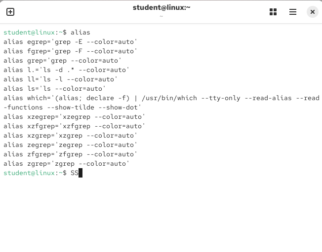
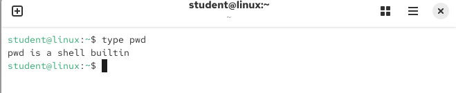
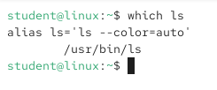

# Essential Tools

## Objective

To learn the basic Linux skills needed to take the RHCSA exam.

## Concepts Learned

- Basic Shell Skills
- Editing Files with vim
- Editing Files with nano
- Understanding the Shell Environment

## Understanding Commands

### ls

List the files of a directory

To modify the behavior of a command you can use options. 

Example: Using "-l" with ls a long listing of filenames and properties will be displayed.

Anything you put after the command is considered an argument (including options). 

Example: Using "ls -l/etc" 

So using this command, you have two arguments (anything after the command), but specifically an option with an argument. The option being "-l" and the argument being "etc"

So the first argument "-1" is modifying the behavior of the command. The second part of the argument "etc" tells the command specifically where to work. 

## Executing Commands

The purpose of Linux shell is to provide an environment to execute commands. 

The shells takes care of interpretiung the proper command that a user inputs.

How the shells does that, interprets the command in three distinct ways.
1. Aliases
2. Internal Commands
3. External Commands

Alias is a command that a user can define as needed. Typing "alias" in the command line will show an overview of it. 

Internal command, also known as/referred to a shell builtin. It is apart of the shell itself, so it doesn't have to be loaded from disk separately. 

External command is a command that exist as an executable file on the disk of a computer

To find out if a command is an internal command or an external command you can use the type command

To change how the shell finds an external command, use "$PATH" variable. It defines for a list of directories for the matching filename when a user enters a command. 

To find EXACTLY which command the shell will use, use the "which" command. 

A stronger command is "type". Which will also work on internal commands and aliases. 

echo $PATH types out the contents of the $PATH variable

## I/O Redirection

The computer monitor is used as the standard destination for output = STDOUT 
The shell also has default standard destinations to send errors messages to (STDERR) and to accept input (STDIN)

Linux commands use three standard data streams:

| Name | Default Destination | Use in Redirection | File Descriptor Number |
| --- | --- | --- | --- |
| STDIN | Computer keyboard | `<` (same as `0<`) | 0 |
| STDOUT | Computer monitor | `>` (same as `1>`) | 1 |
| STDERR | Computer monitor | `2>` | 2 |

### Standard Input (STDIN) - 0

STDIN is the information that a command receives as input.

By default, STDIN normally comes from the keyboard.

The '<' operator can redirect input so that a command receives its input from a file instead. 

Example: 

'command < input.txt'

Instead of waiting for keyboard input, the command receives its input from 'input.txt'

### Standard output (STDOUT) - 1

STDOUT is the normal output produced by a command.

By default, STDOUT is displayed on the terminal

The '>' operate redirects STDOUT to a file

Example: 

'ls /etc > files.txt'

Instead of displaying the standard destination to the monitor as its standard output, the normal output is written to 'files.txt'

'>' is equivalent to '1>' because STDOUT uses file descriptor 1.

Example:

'ls /etc 1> files.txt'

### Standard Error (STDERR) - 2

STDERR contains error messasges produced by a command.

By default, STDERR is also displayed on the monitor/terminal, but Linux treats it separately from STDOUT.

The '2>' operator redirects error messages to a file.

Example:

'ls /doesnotexist 2> errors.txt'

The error message will not display onto the terminal, instead error message is written to 'errors.txt'.

### Mental Model

'0 = IN'
'1 = OUT'
'2 = ERROR'

Redirection lets you change where input comes from or where output goes.

Normally:

Keyboard -> STDIN -> Command -> STDOUT/STDERR -> Terminal

With redirection:

File -> STDIN -> Command -> STDOUT/STDERR - File

## Using Pipes 

A pipe ('|') takes the STDOUT of one command and uses it as the STDIN of another command. This allows multiple to work together.

Example:

ls -R / | less

In this command, the output of 'ls -R /' becomes the input for 'less', allowing the results to be viewed and scrolled through more easily

### My Mental Model

Command 1 -> STDOUT -> | STDIN -> Command 2

By default, a pipe connects STDOUT (1) of the first command to STDIN (0) of the second command. STDERR (2) is not automatically sent through the pipe.

### Bash History

Bash history keeps track of commands that have been executed, making it easier to find and reuse commands.

During an active shell session, command history is stored in memory. When the session is closed, the history is then saved to '.bash_history' file located in the user's home directory. 

| Command | Description | 
| --- | --- |
| 'history' | Displays previously executed commands |
| 'Ctrl-R' | Reverse searches through command history |
| '!text' | Executes the most recent command beginning with the specified text |
| 'history -d number' | Deletes the specified number in the history entry |
| 'history -c' | Clears the current in-memory history |
| 'history -w' | Writes the current history to '.bash_history' |
